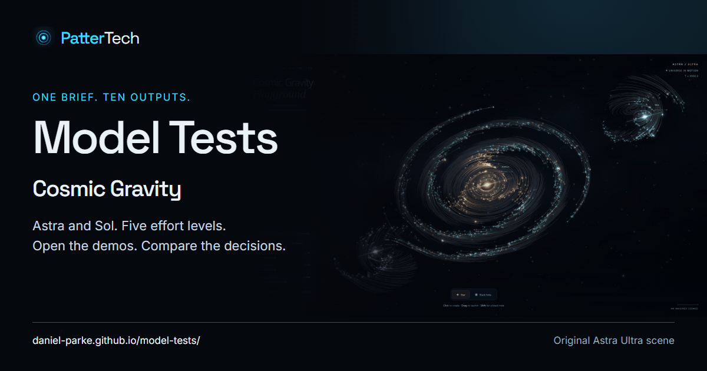

# Model Tests

Open the demos, compare the decisions and read the original prompts. These are practical examples of AI-generated work from PatterTech, not formal benchmarks.

**[Explore the public site](https://daniel-parke.github.io/model-tests/)** · [Prompt and methodology](experiments/cosmic-gravity/) · [Original prompt](HTML%20-%20Space/prompt.md)

## Cosmic Gravity

The task: create an interactive gravity simulation inside one self-contained HTML file. Astra and Sol each have five effort levels to explore. Download any original HTML file and open it in your browser. No installation is needed.

<!-- RESULTS:START -->

| Model | Effort | Original HTML | Publication |
| --- | --- | --- | --- |
| Astra | Light | [Open](HTML%20-%20Space/cosmic-gravity-astra-light.html) | Published |
| Sol | Light | [Open](HTML%20-%20Space/cosmic-gravity-playground-sol-light.html) | Published |
| Astra | Medium | [Open](HTML%20-%20Space/cosmic-gravity-astra-medium.html) | Published |
| Sol | Medium | [Open](HTML%20-%20Space/cosmic-gravity-playground-sol-medium.html) | Published |
| Astra | High | [Open](HTML%20-%20Space/cosmic-gravity-astra-high.html) | Published |
| Sol | High | [Open](HTML%20-%20Space/cosmic-gravity-sol-high.html) | Published |
| Astra | Extra High | [Open](HTML%20-%20Space/cosmic-gravity-astra-extra-high.html) | Published |
| Sol | Extra High | [Open](HTML%20-%20Space/cosmic-gravity-sol-extra-high.html) | Published |
| Astra | Ultra | [Open](HTML%20-%20Space/cosmic-gravity-astra-ultra.html) | Published |
| Sol | Ultra | [Open](HTML%20-%20Space/cosmic-gravity-sol-ultra.html) | Published |

<!-- RESULTS:END -->

Publication status is recorded in [the catalogue](catalogue.json). All ten outputs and the redesigned site were published and verified on 5 September 2026. The complete media pack remains local; only website previews and social metadata assets are included in the site.

## What the comparison means

The original simulation brief stays the same. The earliest four runs predate a short naming paragraph added for later runs. Historical tool access, context and interventions were not fully recorded. These examples do not establish general quality, speed or cost rankings.

We preserve the delivered files. Screenshots, recordings, website improvements and commentary are produced separately. Astra Ultra is featured as an editorial choice.

- [Methodology and future runs](docs/methodology.md)
- [Validation evidence and limitations](docs/validation.md)
- [Current review handover](docs/review-handover.md)
- [Contributing an experiment or reporting a problem](CONTRIBUTING.md)
- [Local preview, maintenance and publication](docs/maintenance.md)
- [Reusable media tools and export profiles](docs/media.md)
- [Prepared GitHub and social content](docs/publication.md)

## Local preview

With Node.js 22 or later:

    node tools/serve.cjs

Open the local address printed in the terminal. The site is ordinary static HTML, CSS and JavaScript. Maintenance tools do not add a visitor-side build step.

## Reuse

Code, demos and associated documentation use the [MIT licence](LICENSE). [Branding and third-party assets](THIRD_PARTY_NOTICES.md) have separate terms. Attribution is appreciated; do not imply that a modified version is an official PatterTech release.
